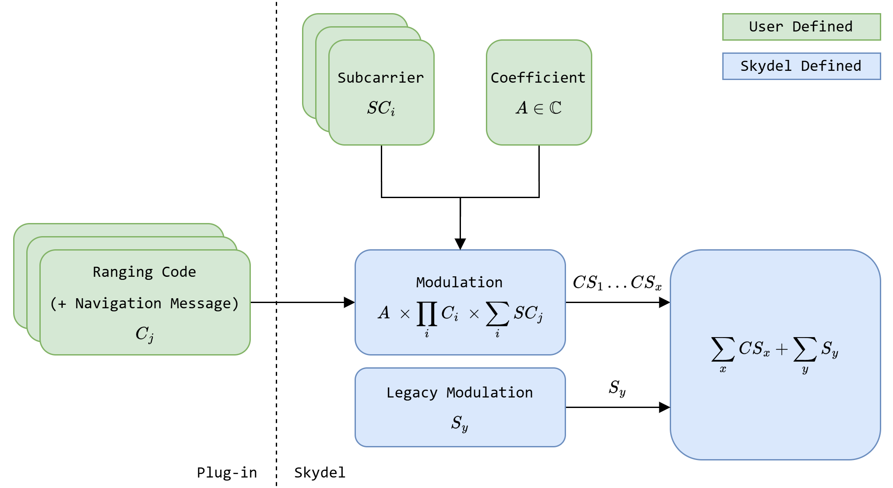
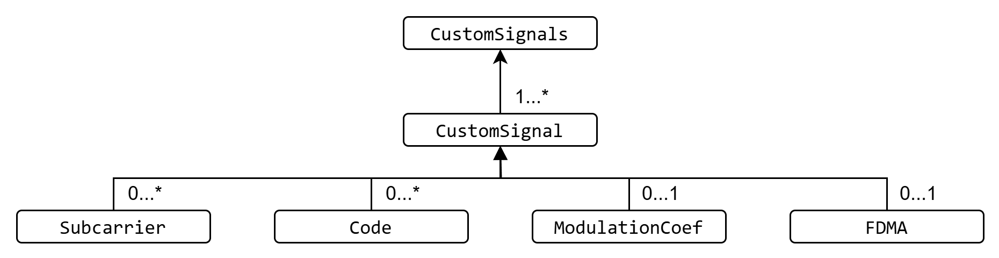

# Custom Signal


If you're still using the legacy architecture and haven't yet migrated to plug-ins, please refer to [migration.md](legacy-custom-signal/migration.md "mention").


The plug-in SDK provides functions that allow users to create their own custom signals and attach them to GNSS satellites so they are streamed alongside standard GNSS signals. It serves as a powerful tool for advanced users looking to design GNSS or non-GNSS signals (such as those from LEO constellations) and evaluate their performance.

The goal of the plug-in SDK is to eliminate the complex task of developing an engine that simulates satellite dynamics, vehicle motion, and associated environmental effects (such as atmospheric delays, multipath, jamming, and spoofing). This allows users to focus entirely on the design and architecture of their custom signal.

The following sections provide essential information on how to integrate custom signals into Skydel, guiding users through the development process. For more details on the specific [custom-signal-factory](plug-in-development/roles/custom-signal-factory/ "mention") Role, refer to the dedicated section.

## Design

A custom signal is composed of an arbitrary number of subcarriers and codes, with its composition defined in an accompanying XML file. The chips for each code must be supplied by the custom signal plug-in, as illustrated in the figure below. Once the codes are provided, Skydel handles the rest of the signal generation chain.

<figure><picture><source srcset=".gitbook/assets/cs_base_arcitecture_dark.png" media="(prefers-color-scheme: dark)"></picture><figcaption>
Custom signal plug-in code chips transmission to Skydel
</figcaption></figure>

The IQ samples are generated according to the following equation :

$$
sample(t)=A× ∏^C_{i=1}C_i(t)×SC(t)
$$

where :

* $$A$$ a constant (in $$ℂ$$) multiplication factor
* $$C$$ the number of codes
* $$C_i(t)$$ are the code chips value (-1 or 1) defined in the plug-in
* $$SC(t)$$ the subcarriers defined as:

where :

$$
SC(t)=1 \space if \space S=0, \space ∑^S_{j=1}SCj(t) \space otherwise
$$

* $$S$$ the number of subcarriers
* $$SC_j(t)$$ are the subcarrier Real values defined in the XML file

With this approach, it is possible to generate various GNSS modulation types, such as _BPSK(N)_, _BOC(M,N)_, and _MBOC(M,N,P)_. The [example](https://github.com/learn-safran-navigation-timing/skydel-example-plugins/tree/master/source/custom_signals) repository contains a set of legacy GNSS signals that demonstrate this capability. These examples use a recording of the Skydel downlink to replay the navigation message and generate the signal chips. Each example is valid for a specific time range, based on the content of the downlink file. You can replace the downlink file to test different configurations. The tracking performance and signal accuracy have been validated using a GNSS receiver.

## XML File

As explained in the [#design](custom-signal.md#design "mention") section, the XML file contains configuration information that defines part of the custom signal’s behavior. Below are the details of the information that must be provided in the XML file for Skydel to properly import and interpret the custom signal.

Here's the high level representation of the XML file.

<figure><picture><source srcset=".gitbook/assets/xml_file_format_dark.png" media="(prefers-color-scheme: dark)"></picture><figcaption>
Custom signal XML format
</figcaption></figure>


For array types in the XML file, both `,` and `|` can be used as delimiter characters.


### Custom Signals

This element is mandatory, defines the root of the XML file and will include all the custom signals definition associated with the plug-in.

Multiple custom signals can be defined within the same XML file, provided they are all handled by the same plug-in. For example, the [Galileo E1 signal](https://github.com/learn-safran-navigation-timing/skydel-example-plugins/blob/master/source/custom_signals/example_galileo_e1/custom_e1.xml) includes two custom signal definitions in a single XML file: one for the _E1b_ component and another for the _E1c_ component.

### CustomSignal

This element can appear multiple times, with each instance representing a distinct custom signal. It contains the essential information needed to define the signal’s behavior and properties, allowing it to be added to Skydel’s signal selection.

Below are the mandatory sub-elements that must be specified for each _CustomSignal_ instance.

<table><thead><tr><th width="134.81817626953125">Parameter</th><th>Definition</th></tr></thead><tbody><tr><td>Name</td><td>Custom signal unique identifier, will be used in Skydel GUI and RAPI as a key.</td></tr><tr><td>Version</td><td>Document interface version, current version is “1.0”.</td></tr><tr><td>Constellation</td><td>The constellation of the custom signal All constellations are supported except SBAS.</td></tr><tr><td>CentralFreq</td><td>The central frequency of the custom signal in Hertz.</td></tr><tr><td>Bandwidth</td><td>The bandwidth of the custom signal in Hertz.</td></tr></tbody></table>

Below are the optional sub-elements that must be specified for each CustomSignal instance.

<table><thead><tr><th width="164.54541015625">Parameter</th><th>Definition</th></tr></thead><tbody><tr><td>NavMsg</td><td>If missing, it will attempt to get a navigation message from the plug-in. If set to True, it will generate an error if the navigation message is missing from the plug-in.</td></tr><tr><td>SignalLevel</td><td>Default power offset relative the constellation reference power in dB.</td></tr><tr><td>SignalTimeDelays</td><td>An array of real numbers representing the delay to be added to a signal in nanoseconds. The size of the array is equal to the number of satellites in the Custom Signal Constellation. For example, For a GPS Custom Signal, if the TGD of a satellite is 5.12 ns, and you want to set an ISC for your Custom Signal of -2.36 ns for this satellite, you need to set the Signal Time Delay of the satellite to TGD - ISC = 7.48 ns. This parameter is not configurable for custom signal on the Glonass constellation.</td></tr></tbody></table>

### Subcarrier

The _Subcarrier_ element is optional. As an example, see [Galileo E1](https://github.com/learn-safran-navigation-timing/skydel-example-plugins/blob/master/source/custom_signals/example_galileo_e1/custom_e1.xml).

<table><thead><tr><th width="100">Parameter</th><th>Definition</th></tr></thead><tbody><tr><td>Id</td><td>Subcarrier identifier.</td></tr><tr><td>Rate</td><td>Subcarrier rate in Hertz.</td></tr><tr><td>Coef</td><td>An array of real numbers representing the subcarrier chip values. For example, a BOC would have the [-1, 1] coefficients. A CosBOC at half power would have the [-0.5, 0.5, 0.5, -0.5] coefficients.</td></tr></tbody></table>

### Code

The _Code_ element is optional. As an example, see [GPS CA](https://github.com/learn-safran-navigation-timing/skydel-example-plugins/blob/master/source/custom_signals/example_gps_ca/custom_ca.xml).

<table><thead><tr><th width="100">Parameter</th><th>Definition</th></tr></thead><tbody><tr><td>Id</td><td>Code identifier, can be used to distinguish different custom signals in the same plug-in.</td></tr></tbody></table>

### ModulationCoef

The _ModulationCoef_ element is optional. As an example, see [Galileo E1](https://github.com/learn-safran-navigation-timing/skydel-example-plugins/blob/master/source/custom_signals/example_galileo_e1/custom_e1.xml).

<table><thead><tr><th width="100">Parameter</th><th>Definition</th></tr></thead><tbody><tr><td>Real</td><td>The real part of the multiplier applied to every sample.</td></tr><tr><td>Imag</td><td>The imaginary part of the multiplier applied to every sample.</td></tr></tbody></table>

### FDMA

The _FDMA_ element is optional. As an example, see [Glonass G1](https://github.com/learn-safran-navigation-timing/skydel-example-plugins/blob/master/source/custom_signals/example_glonass_g1/custom_g1.xml).

<table><thead><tr><th width="240">Parameter</th><th>Definition</th></tr></thead><tbody><tr><td>ChannelOffset</td><td>The frequency offset in hertz between channels (SV IDs). This value will be multiplied by the given channel assignation for an SV ID.</td></tr><tr><td>Channels</td><td>Integer assignations for each channel. Requires as many channels as available SV IDs in the signal's constellation.</td></tr></tbody></table>

### GPS CA Example

Here's a digest of the [GPS CA](https://github.com/learn-safran-navigation-timing/skydel-example-plugins/blob/master/source/custom_signals/example_gps_ca/custom_ca.xml) custom signal example XML file.

<table><thead><tr><th width="160.90911865234375">Parameter</th><th width="151.818115234375">Value</th><th>Explanation</th></tr></thead><tbody><tr><td>Name</td><td>CustomCa</td><td>The custom signal unique name, making sure it's not allready used by Skydel.</td></tr><tr><td>Version</td><td>1</td><td>The current document version.</td></tr><tr><td>NavMsg</td><td>True</td><td>Since the custom signal has a navigation message.</td></tr><tr><td>Constellation</td><td>GPS</td><td>The custom signal is a GPS CA clone, it runs on the GPS constellation.</td></tr><tr><td>CentralFreq</td><td>1575420000</td><td>It's the central frequency of the GPS CA signal.</td></tr><tr><td>Bandwidth</td><td>2046000</td><td>It's the bandwidth necessary to properly generate the signal.</td></tr><tr><td>ModulationCoef</td><td>Real = 0, Img = 1</td><td>Default configuration for the GPS CA signal.</td></tr><tr><td>Codes</td><td>Id = L1CA</td><td>If the plug-in code ever need to know what is the code.</td></tr></tbody></table>

## Usage in Skydel

Once your custom signal has been compiled as a plug-in and its corresponding XML file is defined, it is ready to be imported into Skydel. To do so, simply place the compiled plug-in and its associated XML file in the plug-in discovery folder, located at _Skydel-SDX / Plug-ins_.

If you're using a custom signal example that relies on a downlink file, make sure to also copy the required downlink file into the same folder, alongside the plug-in and XML file.


It's important that the custom signal plug-in and the XML file have the same name.\
For example, if the plug-in is named _custom\_e1.dll_ (on Windows) or _libcustom\_e1.so_ (on Ubuntu), the XML file should be named _custom\_e1.xml_.


After restarting Skydel, you can enable your custom signal plug-in like any other plug-in via the _Help / Plug-ins..._ menu. Once enabled, your custom signal will appear in the _Settings / Custom Signals / Your Custom Signal Name_ page, where you’ll have access to its basic configuration options. It will also be available for assignment to an output.

That’s it, you’re now ready to run simulations using your custom signal!

## Implementation

Refer to [custom-signal-factory](plug-in-development/roles/custom-signal-factory/ "mention") for details on how to implement a custom signal plug-in.
