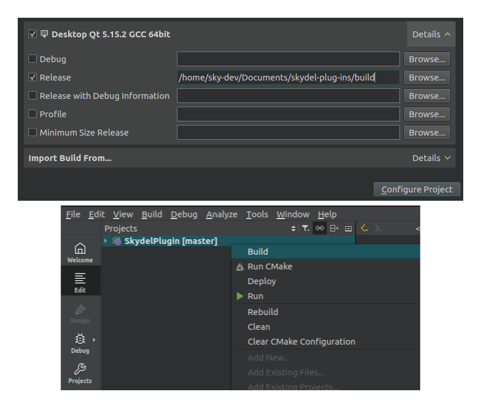

# Compilation

## Plug-in  SDK Compilation

### Source Code

```
git clone https://github.com/learn-safran-navigation-timing/skydel-plug-ins
```

### Qt Creator

In Qt Creator, open the **CMakeLists.txt** file from the root  folder:











### Command Line



<pre><code>mkdir build &#x26;&#x26; cd build
cmake -GNinja -DCMAKE_BUILD_TYPE=Release ..
<strong>cmake --build .
</strong><strong>sudo cmake --install .
</strong></code></pre>




```
mkdir build
cd build
call "C:\Program Files (x86)\Microsoft Visual Studio\2019\BuildTools\VC\Auxiliary\Build\vcvars64.bat"
cmake -GNinja -DCMAKE_BUILD_TYPE=Release ..
cmake --build .
cmake --install .
```




#### Additional CMake Arguments

| Argument               | Description                            | Default Value                         |
| ---------------------- | -------------------------------------- | ------------------------------------- |
| `CMAKE_INSTALL_PREFIX` | Destination folder of the Plug-ins SDK | -                                     |
| `PLUGIN_INSTALL_DIR`   | Destination folder of the examples     | _$HOME/Documents/Skydel-SDX/Plug-ins_ |


## Plug-in Examples Compilation

### Source Code

```
git clone https://github.com/learn-safran-navigation-timing/skydel-example-plugins
```

### Compilation

See [#plug-in-sdk-compilation](compilation.md#plug-in-sdk-compilation "mention").

The compiled plugin examples will be located in your _build folder / source / plugin-name_ as a _.so_ or _.dll_ file.

## Using the SDK in an Other CMake Project

After installing the SDK, It can be imported into your own CMake project by adding the following lines in your CMakeLists:

```
find_package(SkydelPlugin)
target_link_libraries(MyPlugin PUBLIC Skydel::SkydelPlugin)
```

