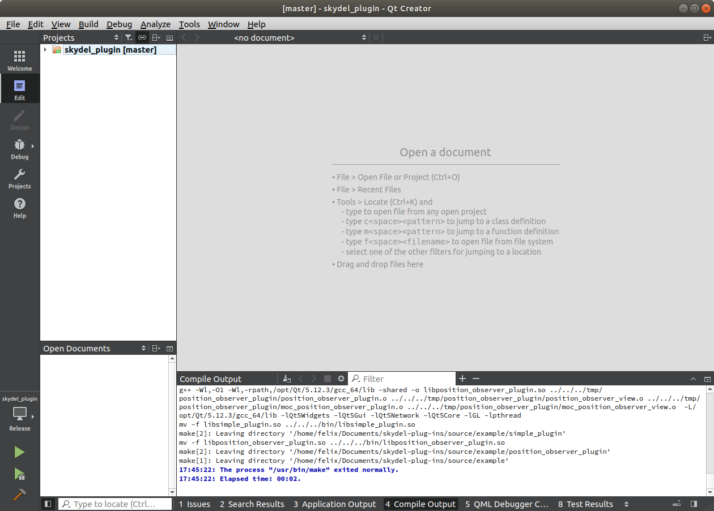

# Ubuntu 18.04

## Prerequisites

### System Dependencies

```text
sudo apt-get update
sudo apt install build-essential libgl1-mesa-dev libxcb-xinerama0 liblapack-dev
```

### GCC 7.5

The GCC compiler is already installed, make sure the version is _7.5:_

```text
gcc -v
```

### Qt Open Source 5.12.3

#### Installation

Update the email\(_QT\_EMAIL_\) and password\(_QT\_PW_\) accordingly, then launch the installation:

```text
wget https://download.qt.io/official_releases/online_installers/qt-unified-linux-x64-online.run -O /tmp/qt-installer.run

chmod +x /tmp/qt-installer.run

sudo /tmp/qt-installer.run install qt.qt5.5123.gcc_64 qt.tools.cmake qt.tools.qtcreator \
	--root /opt/Qt \
	--auto-answer telemetry-question=No --accept-licenses --default-answer --accept-obligations --confirm-command \
	--email QT_EMAIL \
	--pw QT_PW

rm /tmp/qt-installer.run
```


If Qt Creator refuses to open, enable debug traces to help find the source of the problem:`export QT_DEBUG_PLUGINS=1 && /opt/Qt/Tools/QtCreator/bin/qtcreator`


#### Configuration

Open Qt Creator, go to _Tools / Options... / Kits_ and select _Desktop Qt 5.12.3 GCC 64bit \(default\):_


Make sure to match the following:

* Compiler 
  * C: _GCC\(C, x86 64bit in /usr/bin\)_
  * C++: _GCC\(C++, x86 64bit in /usr/bin\)_
* Qt version : _Qt 5.12.3 GCC 64bit_

### Git 2.17.1

```text
sudo apt install git
```

## Compilation

### Getting the Source Code

The GitHub repository contains the Skydel Plug-ins SDK and some examples:

```text
git clone https://github.com/learn-orolia/skydel-plug-ins
```

#### Updating the Souce Code

```text
cd skydel-plug-ins
git pull
```

#### Getting a Specific Version of the Source Code


Checkout this [page](https://github.com/learn-orolia/skydel-plug-ins/releases) for supported versions


```text
cd skydel-plug-ins
git checkout VERSION
```

### Compiling the Source Code

Open Qt Creator, go to _File / Open File or Project..._ and select the project file located in _skydel-plug-ins / skydel\_plugin.pro_. Make sure the selected kit is _Desktop Qt 5.12.3 QCC 64bit_ and select _Configure Project:_


Go to Projects, change _Edit build configuration_ for _Release_ and disable _Shadow build:_


Go to Edit, right click on the root folder and select _Rebuild:_



Build output can be found in _skydel-plugin-ins / bin_ under the form of a shared object \(e.g. libsimple\_plugin.so\)


To make build output available in Skydel, move the _.so_ file to _Skydel Data Folder / Plug-ins:_


