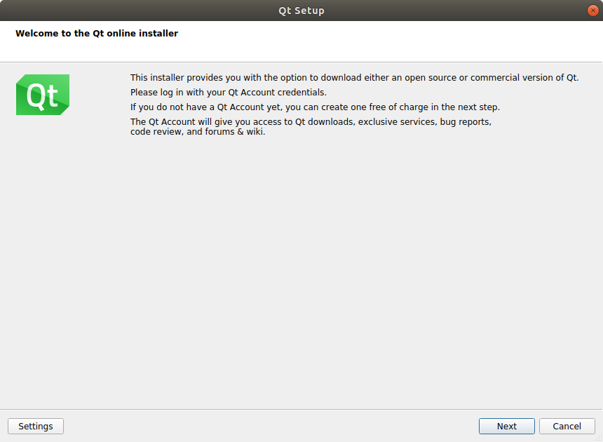
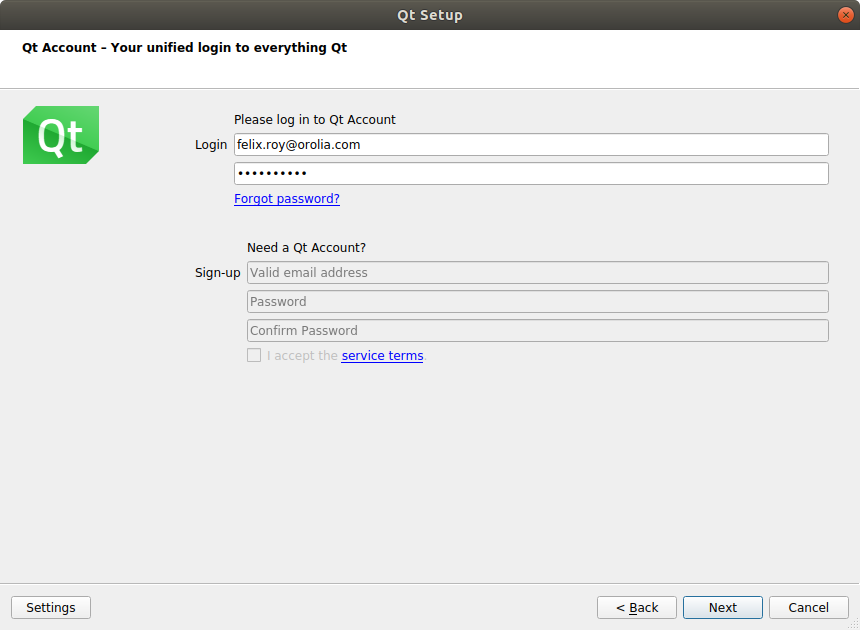
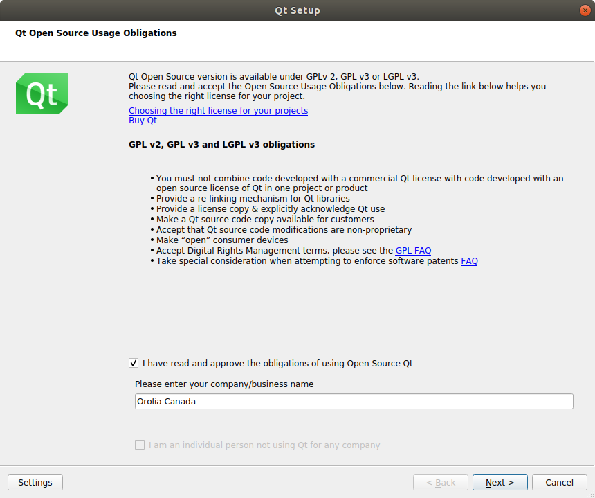
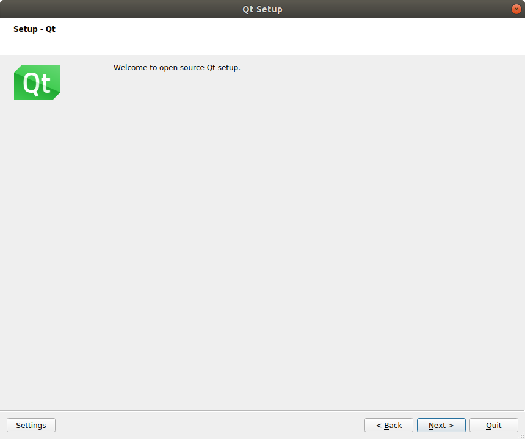
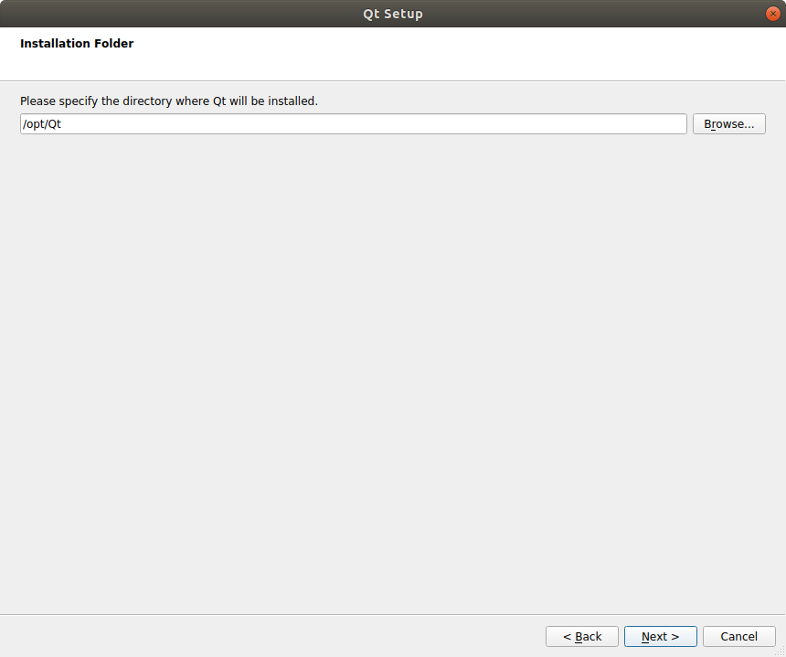
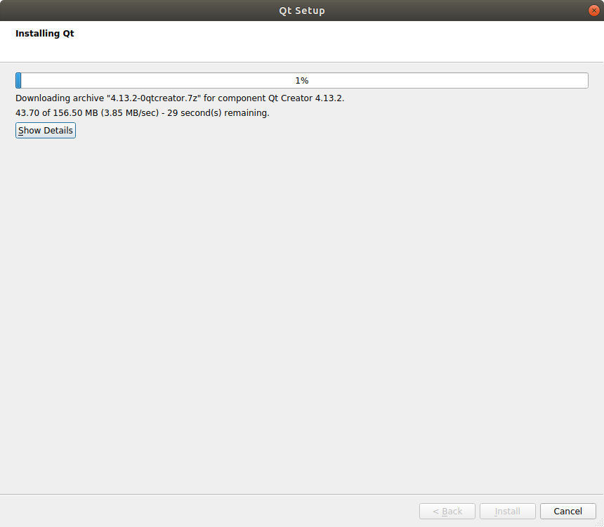
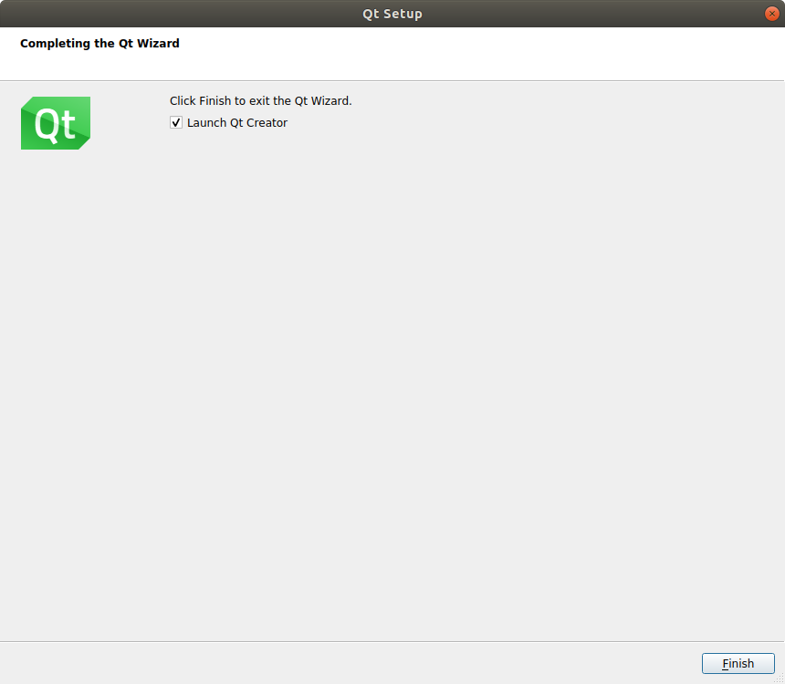

# Ubuntu 18.04

## GCC 7.5

The GCC compiler is already installed, make sure the version is _7.5:_

```text
gcc -v
```

## Qt Open Source 5.12.3

### Installation


The installer name may differ depending of the version name


Download the latest online installer: [https://www.qt.io/download-open-source](https://www.qt.io/download-open-source)

Make the installer an executable and launch it:

```text
chmod +x ./qt-unified-linux-x64-3.2.3-online.run
./qt-unified-linux-x64-3.2.3-online.run
```










Change the installation folder to _/opt/Qt:_



Select _Desktop gcc 64-bit_ under _Qt 5.12.3_ and make sure no option is selected in _Developer and Designer Tools_:


Wait to the installation to end, it may take a while:






If Qt Creator refuses to open, enable debug traces to help find the source of the problem:`export QT_DEBUG_PLUGINS=1 && /opt/Qt/Tools/QtCreator/bin/qtcreator`


### Configuration

Open Qt Creator, go to _Tools / Options... / Kits_ and select _Desktop Qt 5.12.3 GCC 64bit \(default\):_


Make sure to match the following:

* Compiler 
  * C: _GCC\(C, x86 64bit in /usr/bin\)_
  * C++: _GCC\(C++, x86 64bit in /usr/bin\)_
* Qt version : _Qt 5.12.3 GCC 64bit_

## Git 2.17.1

```text
sudo apt install git
```

