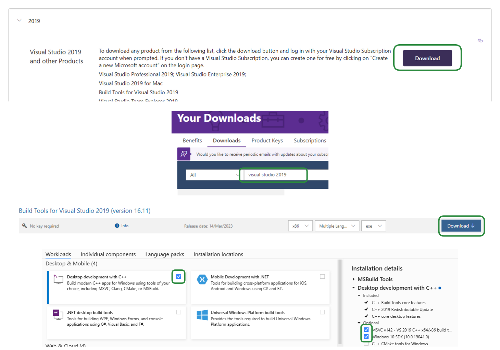

# Windows 10

## MSVC

Download latest Build Tools for Visual Studio 2019 [online installer](https://visualstudio.microsoft.com/vs/older-downloads/#visual-studio-2019-and-other-products) and install C++ build tools.



<details>

<summary>Version should at least be 19.29.30148 for <code>cl</code></summary>

Please note that the version in the execution path of cl might be different on newer versions.

```
C:\Program Files (x86)\Microsoft Visual Studio\2019\BuildTools\VC\Tools\MSVC\14.29.30133\bin\Hostx64\x64\cl.exe
> Microsoft (R) C/C++ Optimizing Compiler Version 19.29.30148 for x64
```

</details>

## Ninja

* Download and unzip [ninja-win.zip](https://github.com/ninja-build/ninja/releases/download/v1.10.1/ninja-win.zip) to _Program Files / ninja-win_
* From the search bar, search for _Edit the system environment variables_
* Select _Envrionment Variables..._
* Select _Path_ in _System variables_ and select _Edit..._
* Select _Browse..._ and find the folder _Program Files / ninja-win_ (where you unziped _ninja-win.zip_)
* After those steps, ninja should be accessible from anywhere

<details>

<summary>Version should be 1.10.1 for <code>ninja</code></summary>

```
ninja --version
> 1.10.1
```

</details>

## Qt

Download the latest [online installer](https://download.qt.io/official\_releases/online\_installers/) named _qt-unified-windows-x64-online.exe_ and install:


```powershell
.\qt-unified-windows-x64-4.4.1-online.exe install qt.qt5.5152.win64_msvc2019_64 qt.tools.qtcreator `
    --root C:\Qt `
    --auto-answer telemetry-question=No --accept-licenses --default-answer --accept-obligations --confirm-command `
    --email QT_EMAIL `
    --pw QT_PW
```



Update the email (_QT\_EMAIL_) and password (_QT\_PW_) accordingly


## CMake

Download and install [CMake](https://github.com/Kitware/CMake/releases/download/v3.22.1/cmake-3.22.1-windows-x86\_64.msi). Make sure to add CMake to the system PATH.

<details>

<summary>Version should be 3.22.1 for <code>cmake</code></summary>

```
cmake --version
> cmake version 3.22.1
```

</details>

## Git

Download and install latest [git](https://gitforwindows.org).

<details>

<summary>Version should at least be 2.40.0 for <code>git</code></summary>

```
git --version
> git version 2.40.0.windows.1
```

</details>
