# Windows 10

## Prerequisites

### Microsoft Visual Studio 2017 Community 15.9.28 for Windows Desktop

Download latest online installer: [https://visualstudio.microsoft.com/vs/older-downloads/](https://visualstudio.microsoft.com/vs/older-downloads/)


Make sure you download _Visual Studio Community 2017_


Open the installer and select _Continue_

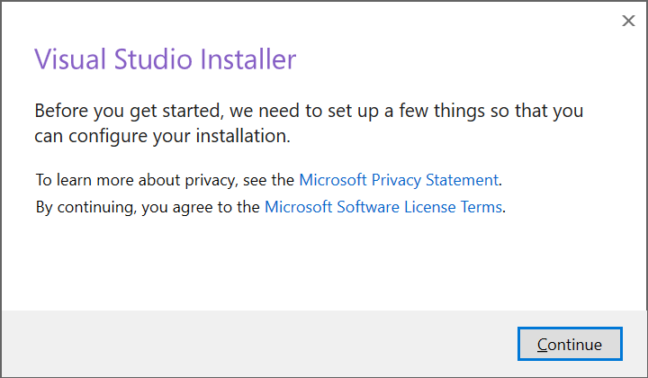

Wait to the setup to end:

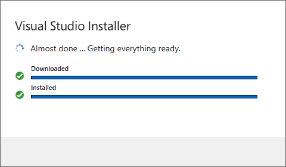

In _Workloads_ select _Desktop development with C++_  then _Install:_

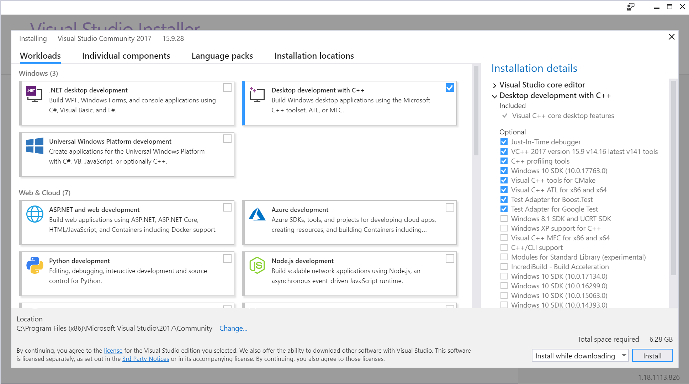

Wait to the installation to end, it may take a while:

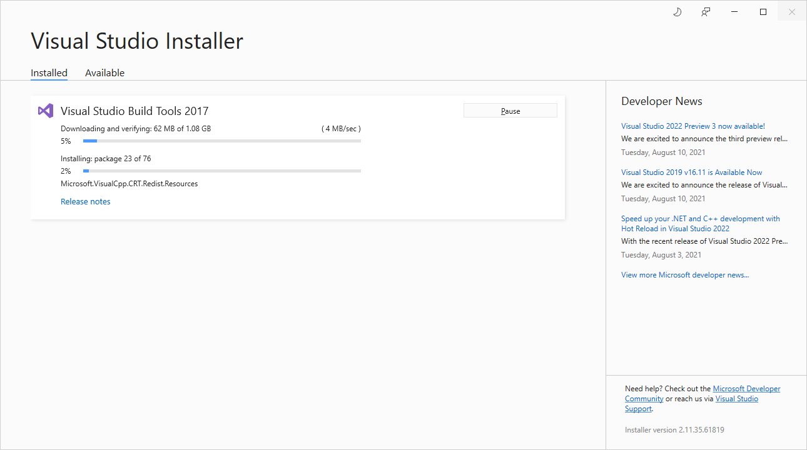

Restart the computer:

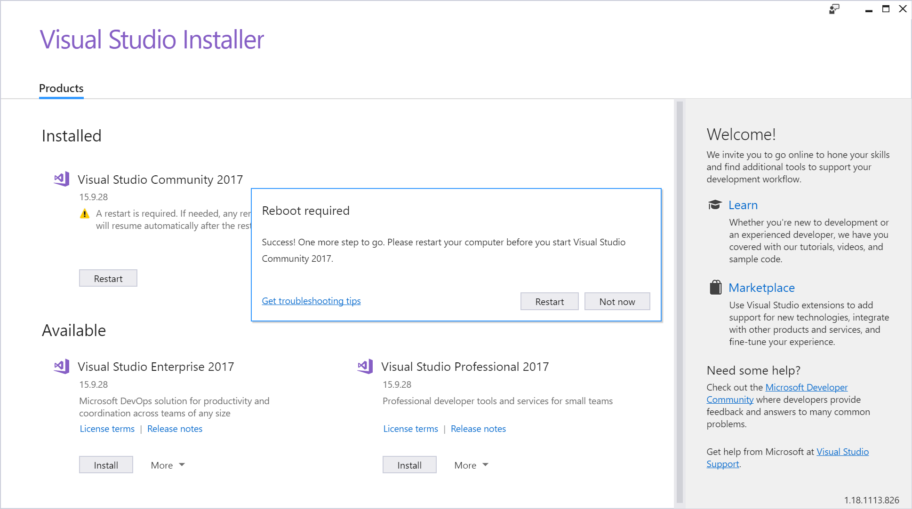

After the restart, open the _Visual Studio Installer_ and make sure _Visual Studio Community 2017_ has version _15.9.28_ or greater:


### Qt Open Source 5.12.3

#### Installation

Download the latest online installer: [https://www.qt.io/download-open-source](https://www.qt.io/download-open-source)

Launch the installer:


Select _MSVC 2017 64-bit_ under _Qt 5.12.3_ and make sure no option is selected in _Developer and Designer Tools_:


Wait to the installation to end, it may take a while:


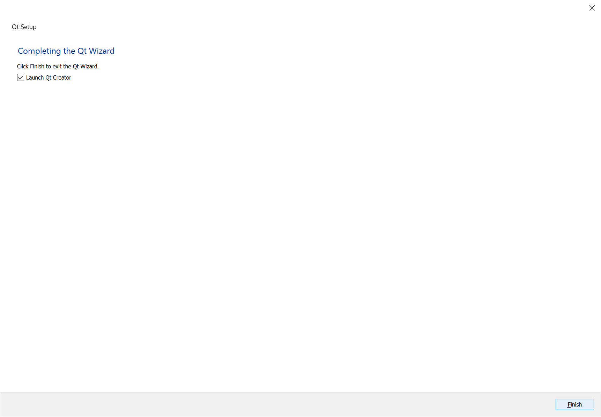

#### Configuration

Open Qt Creator, go to _Tools / Options... / Kits_ and select _Desktop Qt 5.12.3 MSVC2017 64bit \(default\):_

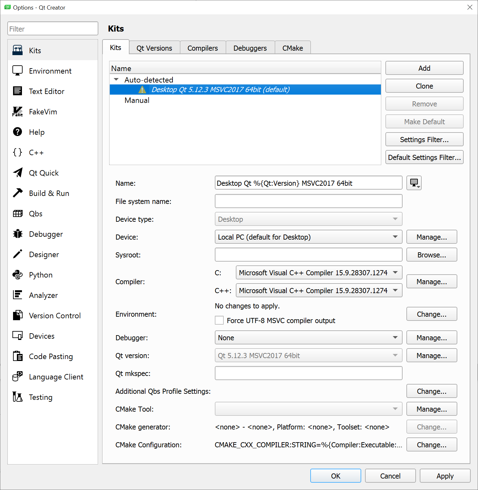

Make sure to match the following:

* Compiler
  * C++: _Microsoft Visual C++ Compiler 15.9.28307.1274_
* Qt version : _Qt 5.12.3 MSVC2017 64bit_

### Git 2.29.0

Download the latest installer [here](https://gitforwindows.org/) and install Git.

## Compilation

#### Getting the Source Code

The GitHub repository contains the Skydel Plug-ins SDK and some examples:

```text
git clone https://github.com/learn-orolia/skydel-plug-ins
```

**Updating the Souce Code**

```text
git pull
```

**Getting a Specific Version of the Source Code**


Checkout this [page](https://github.com/learn-orolia/skydel-plug-ins/releases) for supported versions


```text
git checkout VERSION
```

#### Compiling the Source Code

Open Qt Creator, go to _File / Open File or Project..._ and select the project file located in _skydel-plug-ins / skydel\_plugin.pro_. Make sure the selected kit is _Desktop Qt 5.12.3 MSVC2017 64bit_ and select _Configure Project:_

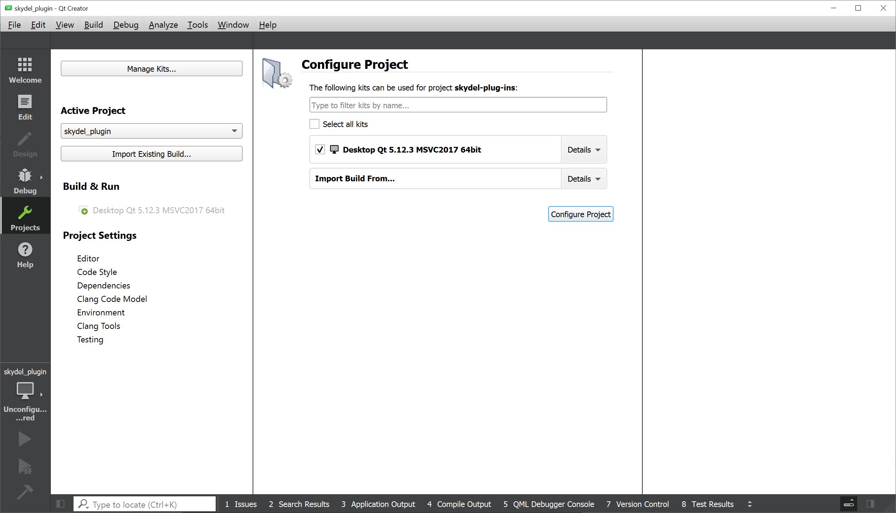

Go to Projects, change _Edit build configuration_ for _Release_ and disable _Shadow build:_

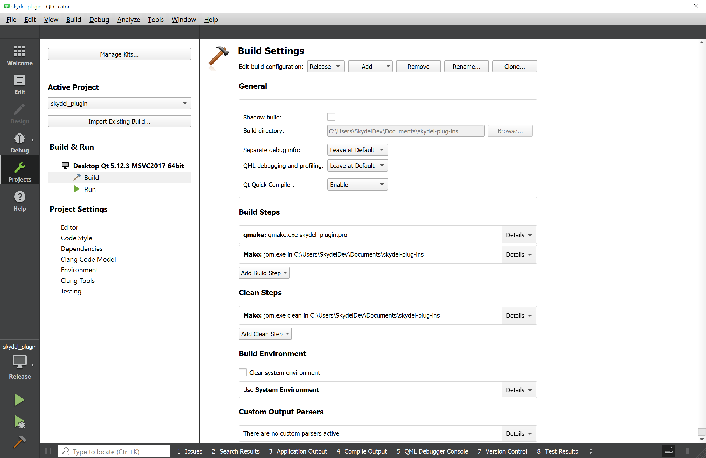

Go to _Edit_, right click on the root folder and select _Rebuild_:

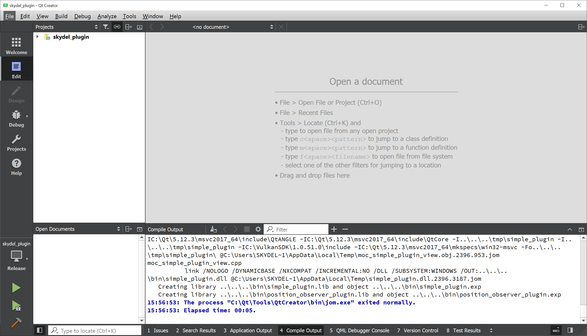

Build output can be found in _skydel-plugin-ins / bin_ under the form of a dynamic-link library \(e.g. simple\_plugin.lib\)

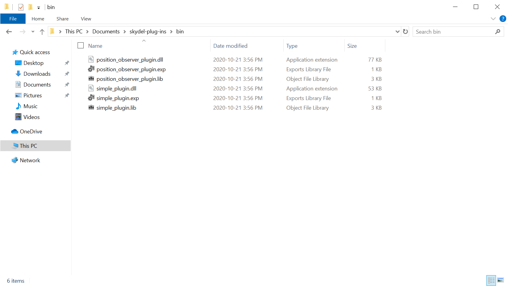

To make build output available in Skydel, move the _.dll_ file to _Skydel Data Folder / Plug-ins:_

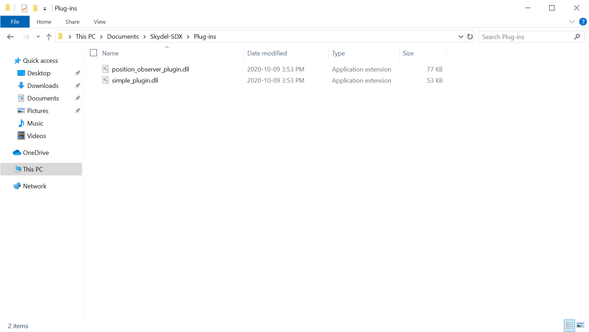

