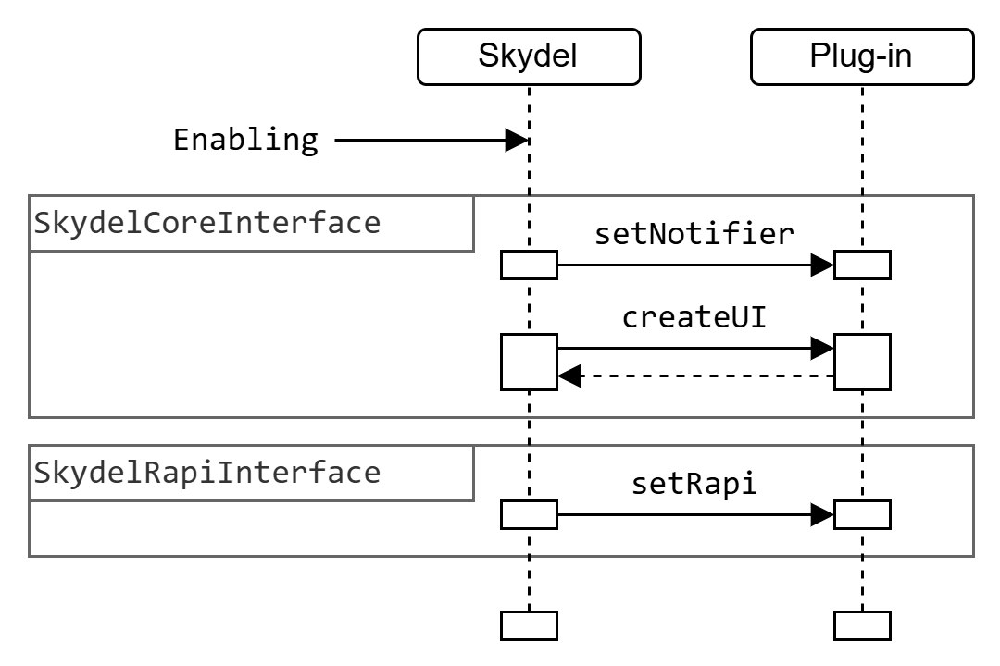

# Enabling

The following diagram summarizes the sequence and order of the interactions when a plug-in enabled. The dotted line represent objects that the plug-in returns to Skydel. For more details, see the [roles](roles/ "mention") section.

<picture><source srcset="../.gitbook/assets/cs_gitbook-enabling_plugin_dark.png" media="(prefers-color-scheme: dark)"></picture>
