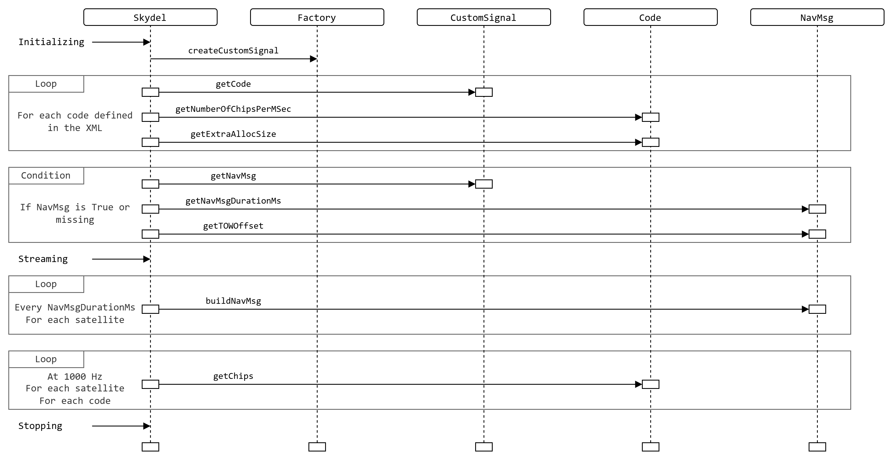

# Custom Signal Factory


If you're still using the legacy architecture and haven't yet migrated to plug-ins, please refer to [migration.md](../../../legacy-custom-signal/migration.md "mention").


## High Level View

All files related to custom signals are located in the _custom\_signal_ folder of the plug-in SDK. Below is some useful information about each file.

| File                                            | Description                                                                                             |
| ----------------------------------------------- | ------------------------------------------------------------------------------------------------------- |
| skydel\_custom\_signal\_factory\_interface.h    | Defines the main interface used to return a custom signal implementation.                               |
| skydel\_custom\_signal\_interface.h             | Defines the interface used to return both code and navigation message implementations.                  |
| skydel\_custom\_signal\_code.h                  | Specifies the interface for defining the code structure of a custom signal.                             |
| skydel\_custom\_signal\_nav\_msg.h              | Specifies the interface for defining the navigation message of a custom signal.                         |
| skydel\_custom\_signal\_constellation\_datas.h  | Contains the data structure for constellation parameters shared with custom signals.                    |
| skydel\_custom\_signal\_initialization\_datas.h | Contains the data structure for initialization data shared with custom signals.                         |
| skydel\_custom\_signal\_types\_bridge.h         | Includes utility functions to bridge legacy custom signal implementations with the new data structures. |
| skydel\_custom\_signal\_types.h                 | Defines the legacy data structures used in older custom signal implementations.                         |

To enable custom signal functionality in a plug-in, it must first inherit from the `SkydelCustomSignalFactoryInterface`, as is the case with any other plug-in role. This interface serves as the entry point for custom signal integration within Skydel.

Through the factory interface, Skydel will request an instance of `SkydelCustomSignalInterface`, which must in turn provide implementations for both `SkydelCustomSignalCode` and `SkydelCustomSignalNavMsg`. These components define the structure and behavior of the signal’s code and navigation message, respectively.

To summarize the terminology used throughout this documentation:

* The factory refers to `SkydelCustomSignalFactoryInterface`
* The custom signal refers to `SkydelCustomSignalInterface`
* The custom signal code refers to `SkydelCustomSignalCode`
* The custom signal navigation message refers to `SkydelCustomSignalNavMsg`

Each of these interfaces exposes a set of methods that must be implemented to ensure full compatibility with the Skydel custom signal engine.

The following figure illustrates the interactions between Skydel and a custom signal, from the initialization state to the streaming state, and finally to stopping. Each step is described in detail in the following sections.

<figure><picture><source srcset="../../../.gitbook/assets/cs_gitbook-cs_interactions_dark.png" media="(prefers-color-scheme: dark)"></picture><figcaption>
Skydels interactions with a custom signal
</figcaption></figure>

## Initialization

During simulation initialization, Skydel calls the `createCustomSignal` method on every plug-in to obtain a `SkydelCustomSignalInterface*`. This method also receives a map containing initialization parameters, provided through the `InitializationDatas` structure. This structure includes important details about the simulation and the custom signal being initialized. Refer to [#initializationdatas](structures.md#initializationdatas "mention") dedicated section for more information about this structure.

Once all custom signal objects are created, Skydel calls `getCode` on each of them to obtain a `SkydelCustomSignalCode*` for every code defined in the XML file. This call provides the name of the code, so the custom signal plug-in knows which implementation to return.

These `SkydelCustomSignalCode` objects are used later during simulation, but at this stage, Skydel calls:

* `getNumberOfChipsPerMSec` to determine the code rate, in chips per millisecond
* `getExtraAllocSize` to determine the size of any additional memory needed for the chip buffer, in bytes

In addition to initializing code objects, some custom signals may include a navigation message. Depending on the XML file configuration, Skydel may call `getNavMsg` on each custom signal, which returns a `SkydelCustomSignalNavMsg*`. With this object, which will also be used later during the simulation if present, Skydel calls:

* `getNavMsgDurationMs` to determine the navigation message duration, in millisecond
* `getTOWOffset` to determine the offset from the beginning of the navigation message to the start of the current Time of Week, in seconds.

At the end of this initialization process, Skydel has all the necessary information to begin the simulation.

## Streaming

During simulation, Skydel calls all custom signal plug-ins every millisecond.

First, Skydel calls `buildNavMsg()` on each custom signal defined by every relevant plug-in, based on the navigation message duration provided during initialization. This call is made for every satellite associated with the constellation using the custom signal. If a custom signal does not include a navigation message, this function will not be called. During this call, custom signals have the opportunity to prepare their next navigation message. Skydel also provides a data structure containing valuable constellation related data during this call. Refer to [#constellationdatas](structures.md#constellationdatas "mention") dedicated section for more information about this structure.

Next is the core simulation function: `getChips()`. This function is called every millisecond by Skydel for each satellite and each defined code. It retrieves the chips to be used to modulate the signal for that millisecond and SV ID. During this call, the custom signal needs to copy it's chips into the buffer `chips`. The buffer is guaranteed to be `getNumberOfChipsPerMSec` + `getExtraAllocSize` long.

These two steps, generating the navigation message and retrieving the signal chips, are repeated continuously throughout the simulation, until the simulation is stopped.

## Stopping

Once the simulation is stopped, Skydel will call the destructors of all the objects returned by the custom signal plug-ins.

## Legacy Structures and Backward Compatibility

Since version 2 of the `SkydelCustomSignalFactoryInterface`, information is shared with custom signal plug-ins using key/value maps. In version 1, this information was provided through fixed structures.

To ease the migration for users relying on the older interface, the `skydel_custom_signal_types_bridge.h` file was added to the SDK. This header provides helper functions to convert the new map based format into the legacy structure format. It also includes examples demonstrating how to access specific information from the new structure.

## Example

See the plug-in examples from [here](https://github.com/learn-safran-navigation-timing/skydel-example-plugins/tree/master/source/custom_signals) for more information. It covers:

* Examples for [BeiDou B1C](https://github.com/learn-safran-navigation-timing/skydel-example-plugins/tree/master/source/custom_signals/example_beidou_b1c), [Galileo E1](https://github.com/learn-safran-navigation-timing/skydel-example-plugins/tree/master/source/custom_signals/example_galileo_e1), [Glonass G1](https://github.com/learn-safran-navigation-timing/skydel-example-plugins/tree/master/source/custom_signals/example_glonass_g1), [GPS CA](https://github.com/learn-safran-navigation-timing/skydel-example-plugins/tree/master/source/custom_signals/example_gps_ca), [GPS TDDM CA](https://github.com/learn-safran-navigation-timing/skydel-example-plugins/tree/master/source/custom_signals/example_gps_tddm_ca) and [QZSS CA](https://github.com/learn-safran-navigation-timing/skydel-example-plugins/tree/master/source/custom_signals/example_qzss_ca)
