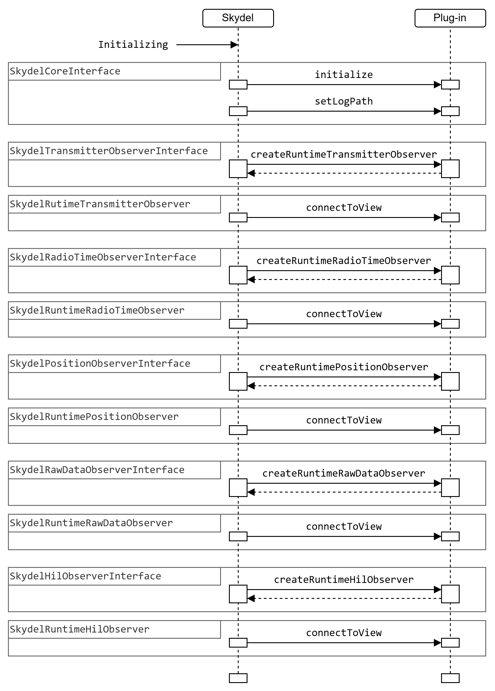
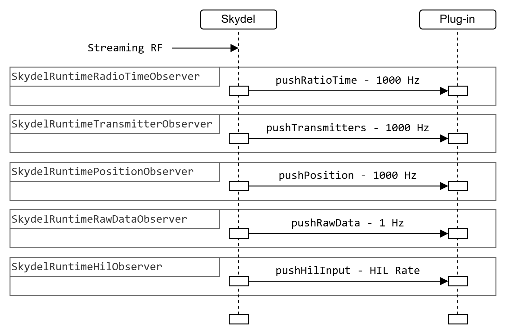

# Runtime

The following diagram summarizes the sequence and order of the interactions during the Simulator Initializing State. The dotted lines represent objects that the plug-in returns to Skydel. For more details, see the [roles](roles/ "mention") section.

<picture><source srcset="../.gitbook/assets/cs_gitbook-runtime_init_dark.png" media="(prefers-color-scheme: dark)"></picture>

The following diagram summarizes the sequence and order of the interactions during the Simulator Streaming RF State. For more details, see the [roles](roles/ "mention") section.

<picture><source srcset="../.gitbook/assets/cs_gitbook-streaming_rf_state_dark.png" media="(prefers-color-scheme: dark)"></picture>
