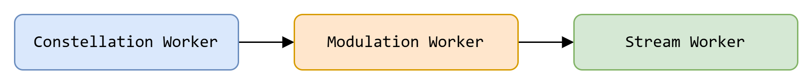
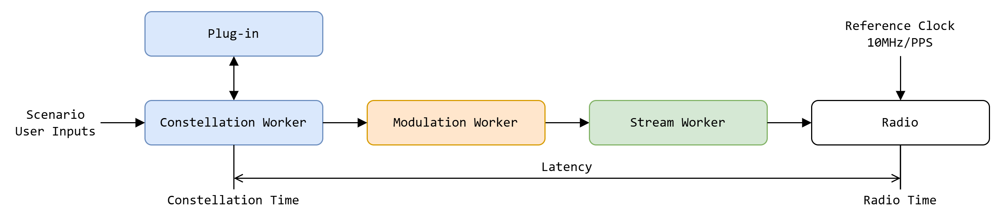

# Time Synchronization

The plug-in SDK includes functions to get the time in the simulation at difference reference points and depending on the desired synchronization, it may require a deeper understanding of the underlying architecture of the Skydel engine.

The Skydel real-time engine performs a massive amount of calculations using the GPUs as coprocessors. The engine processes the simulation in 1 millisecond chunks, and each of them has to pass through 3 workers:

* Constellation Worker
* Modulation Worker
* Streamer Worker

The Constellation Worker calculates the satellites position, the pseudoranges, the propagation lost, the navigation messages, etc. In short, this is the worker handling the scenario and the user inputs. The Modulation Worker performs the modulation using the GPUs and finally, the Streamer Worker transfers the modulated signals to the radios so it can be broadcasted to the desired frequencies.

<picture><source srcset="../.gitbook/assets/time_dark.png" media="(prefers-color-scheme: dark)"></picture>

When the user changes the power level of a signal in the GUI, it is handled by the engine in the constellation worker. The effect of the user input is propagated downstream to the modulation and streamer workers. The time it takes for the user input to pass through the workers and to the radio transmitting the RF signal is called the system latency. The latency is configurable and is usually adjusted based on the need for low latency and the performance of the hardware. It can be as high as 200ms or as low as 5ms. What it means is while the radio is broadcasting the chunk for time T, the constellation worker could be computing the chunk corresponding to time T+Latency. The constellation worker runs as fast as it can and it is throttled to not exceed the radio time by more than the configured latency. The radio consumes the chunks at a very stable rate defined by a precise reference clock (10MHz/PPS).

A plug-in runs in a dedicated thread (worker), and it is connected to the constellation worker. The natural time reference for the plug-in is the time associated to the chunk being computed by the constellation worker.

<picture><source srcset="../.gitbook/assets/cs_gitbook-time_sync_sequence_dark.png" media="(prefers-color-scheme: dark)"></picture>

When the plug-in uses the Real Time Positions role (SkdelPositionObserverInterface) to get the simulated position, it is paired with the elapsed simulation time corresponding to the current chunk used in the constellation worker. This time is in the future with regards to the actual RF signal coming out of the radio and is expressed in milliseconds since the start of the scenario.

If the plug-in needs to control a turn table to rotate the receiver under test to match the simulated heading, it should control the motor to turn at the appropriate time to match the radio time, not the constellation worker time. So while the plug-in receives the heading for a position in the future, it needs to know what is the current radio time and determine when exactly it should turn the table to match the heading provided by the constellation worker.

To do that, the plug-in can use the radio time role (SkydelRadioTimeObserverInterface). This role returns the radio time paired with the OS time. Now the plug-in can use that information to compute what is the OS time matching the elapsed time returned by the SkydelPositionObserverInterface. The helper function getDeadline will do just that.

The follow pseudocode explains how to get the heading of a chunk of simulation from the constellation worker and when to turn the table so that the table is changing heading at the exact time the same chunk is being transmitted by the radio.

1. Get the heading and the associated **elapsed time** from SkydelPositionObserverInterface role
2. Get the **radio time** from SkydelRadioTimeObserverInterface
3. Get the **OS time** corresponding to the moment when the elapsed time will get to the radio using the function getDeadline(**elapsed time**, **radio time**)
4. Control the turn table to be at the correct heading when the computer time is matching the **OS time**

This synchronization method add complexity, but depending on the latency of the system and the synchronization requirement, it might be perfectly adequate for the plug-in to completely ignore the radio time and assume the constellation time is the current time. Before adding complexity to the plug-in, carefully consider whether or not the plug-in needs tight synchronization with the radio time.
