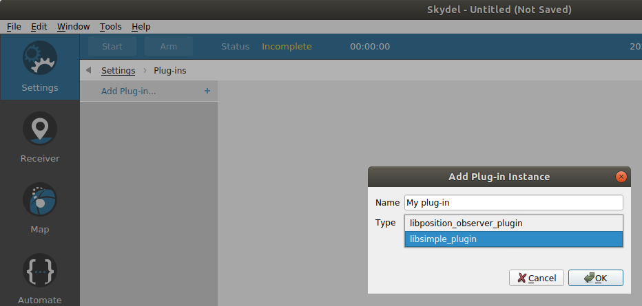
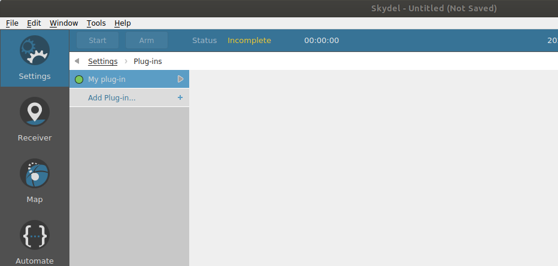
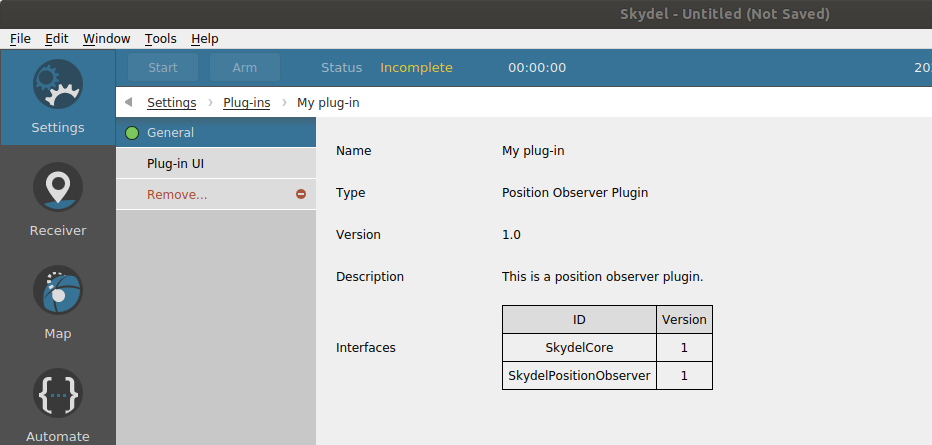
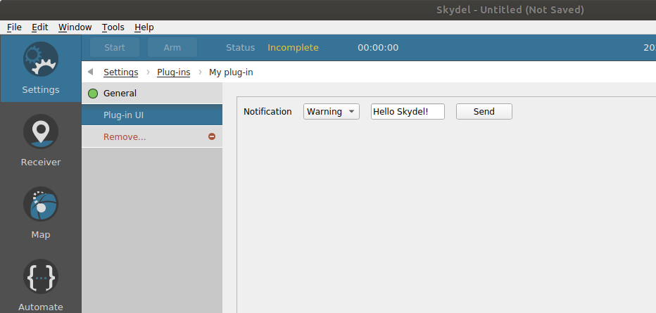
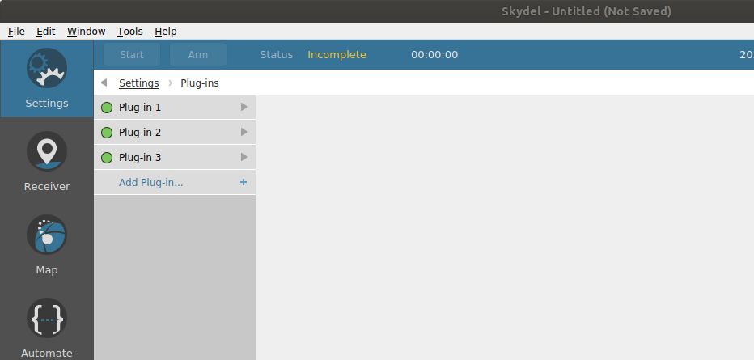

# Using Plug-ins

## What is a plug-in for Skydel?

A plug-in is a shared library \(_.so_ or _.dll_\) that implements some of the interfaces of the Skydel Plug-in SDK.

## How to make a plug-in available in Skydel?

Make sure you copy the plug-in \(_.so_ or _.dll_ file\) into the _Skydel Data Folder / Plug-ins._ When Skydel is launched, it will search that folder in order to list all the available plug-ins.


The search is only done at the launch of Skydel. Creating a new configuration won't trigger a search for new plug-ins


## How to instantiate a plug-in in Skydel?

Go to _Settings / Plug-ins_ and select _Add Plug-in...._ Set the name and type of plug-in instance and select _Ok:_


The Type combobox will display available Plug-ins, see _How to make my plug-in available in Skydel?_ for more information


Select the new instance:

The _General_ menu displays instance unique name and information about the plug-in type:

The _Plug-in UI_ menu displays the widget returned by the plug-in:

## Can a plug-in be instantiated multiple time?

Yes, a plug-in can be instantiated multiple time since all plug-in instances are independent.

