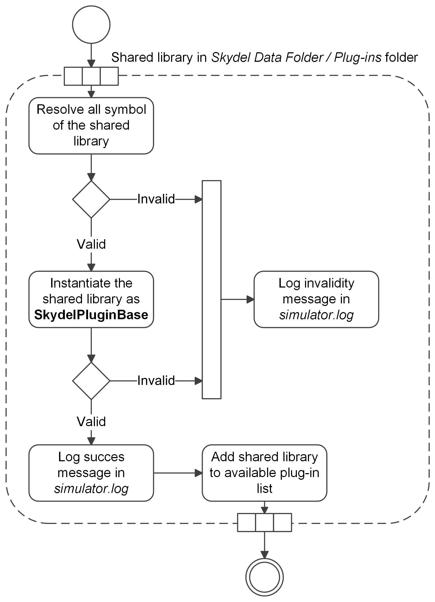

# Using Plug-ins

## What is a plug-in for Skydel?

A plug-in is a shared library (_.so_ or _.dll_) that implements some of the interfaces of the Skydel Plug-in SDK.

## How to make a plug-in available in Skydel?

Make sure you copy the plug-in (_.so_ or _.dll_ file) into the _Skydel Data Folder / Plug-ins._ When Skydel is launched, it will search that folder in order to list all the available plug-ins.

## How to enable/disable a plug-in in Skydel?

Go to _Help / Plug-ins..._ to enable/disable any available plug-in.

<figure><figcaption>
Skydel Plug-ins Dialog
</figcaption></figure>
